## Batt12vHeater
```yaml

connectors:
  X1:
    pinlabels: [PWR,GND]
  MBB2:
    pincount: 36
    hide_disconnected_pins: true

cables:
  W1:
    wirecount: 2
  # Brown or Orange? w/black strip 
    colors: [OGBK, BK]

connections:
  -
    - X1: [1-2]
    - W1: [1-2]
    - MBB2: [12,33]
```

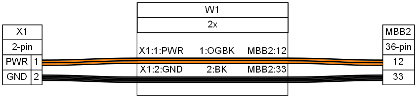

[Source](Batt12vHeater.yml) - [Bill of Materials](Batt12vHeater.bom.tsv)


## CAN
```yaml
connectors:
  X1:
    type: HSG
    subtype: plug
    pincount: 2
    manufacturer: TE
    mpn: 
  X2:
    type: HSG
    subtype: socket
    pincount: 2
    manufacturer: TE
    mpn: 
  X3:
    type: HSG
    subtype: plug
    pincount: 2
    manufacturer: TE
    mpn: 

cables:
  W1:
    wirecount: 2
    colors: [WH, BU]
    notes: Accessory CAN harness

connections:
  -
    - X1: [1-2]
    - W1: [1-2]
    - X2: [1-2]
  -
    - X1: [1-2]
    - W1: [1-2]
    - X3: [1-2]

additional_bom_items:
  -
    description: Label
    manufacturer: APTIV
    mpn: 56-08122 rev 2
    spn: 35114529
```

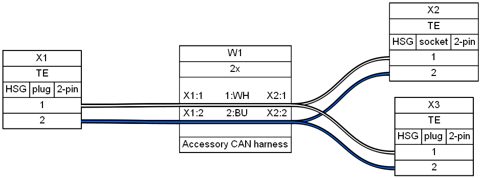

[Source](CAN.yml) - [Bill of Materials](CAN.bom.tsv)


## dash
```yaml
connectors:
  DASH:
    pincount: 34
    hide_disconnected_pins: true
  MBB1:
    pincount: 48
  #  pinlabels: [CANH,CANL,GND]
    hide_disconnected_pins: true
  MBB2:
    pincount: 36
    hide_disconnected_pins: true
  MODE:
  #  pincount: 10
    pinlabels: [LeftTurn,LeftSwitch,Enter,RightSwitch,GND,' ',Hazard,GND,RightTurn,Cancle]
    hide_disconnected_pins: true
  X1:
    pincount: 8
    hide_disconnected_pins: true
    notes: fixme
  BAT:
    pinlabels: [12V,GND]
    notes: fixme
cables:
  W1:
    wirecount: 18
    colors: [BK,BK,BKRD,WH,BN,BKYE,GY,GN,BU,YE,GNBK,BNBU,BUYE,BNBU,BU,WH,BK,BK]

connections:
  -
    - DASH: [1,4,7,8,12,14,15,17,20]
    - W1: [1,2,4,5,7-11] 
    - MODE: [5,5,4,10,9,1,2,3,7]
  -
    - DASH: [31-34]
    - W1: [15-18]
    - MBB1: [5,6,7,7]
  -
    - DASH: [23,25]
    - W1: [12,14]
    - MBB2: [1,1]
  -
    - DASH: [6,9]
    - W1: [3,6]
    - X1: [1,5]
  -
    - DASH: [24]
    - W1: [13]
    - BAT: [12V]
```

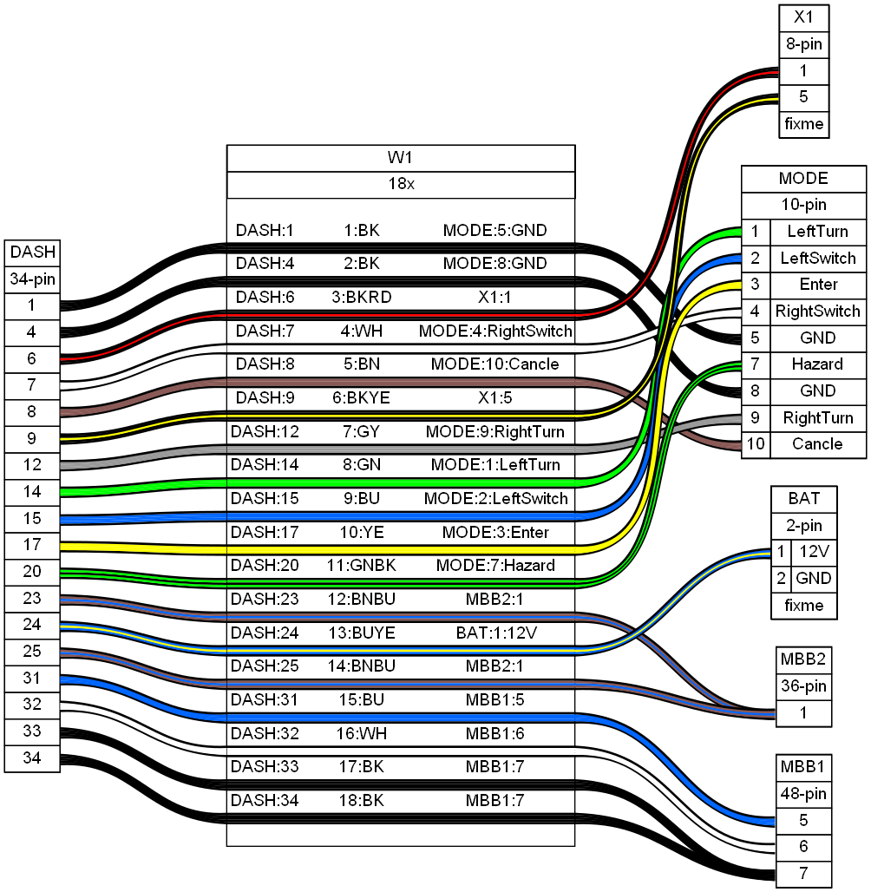

[Source](dash.yml) - [Bill of Materials](dash.bom.tsv)


## heated_grips
```yaml
connectors:
  X1:
    pincount: 2
  X2:
    pincount: 2
  MBB2:
    pincount: 36
    hide_disconnected_pins: true

cables:
  W1:
    wirecount: 4
    colors: [YE, BK, YE, BK]
    notes: heated grips

connections:
  -
    - X1: [1-2]
    - W1: [1-2]
    - MBB2: [5,4]
  -
    - X2: [1-2]
    - W1: [3-4]
    - MBB2: [17,33]
```

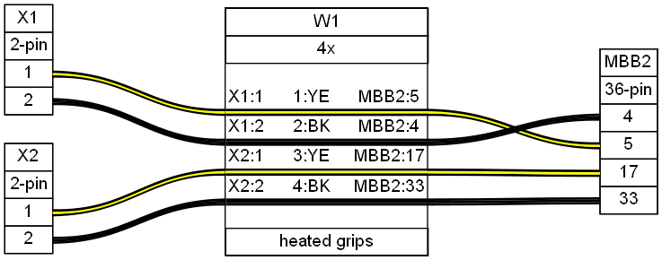

[Source](heated_grips.yml) - [Bill of Materials](heated_grips.bom.tsv)


## IMU
```yaml
connectors:
  X1:
    type: MQS
    pinlabels: [GND, CAN L, CAN H, Power]
    manufacturer: TE
    mpn: '<a href=https://www.te.com/usa-en/product-1-967640-1.html>1-967640-1</a>'
  MBB1:
    pincount: 48
    hide_disconnected_pins: true
  MBB2:
    pincount: 36
    hide_disconnected_pins: true

cables:
  W1:
    wirecount: 4
    colors: [BK, BUGY, WHGY, WHGN]
    notes: Bosch IMU

connections:
  -
    - X1: [GND, CAN L, CAN H]
    - W1: [1,2,3]
    - MBB1: [3-1]
  -
    - X1: [Power]
    - W1: [4]
    - MBB2: [2]
```

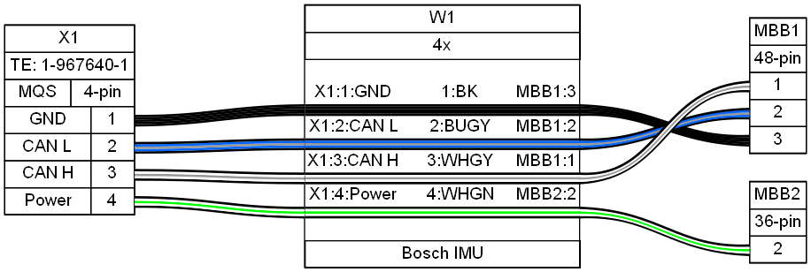

[Source](IMU.yml) - [Bill of Materials](IMU.bom.tsv)


## key
```yaml
connectors:
  KEY:
    pinlabels: [CANH,CANL,'+12v, Key on',GND,'{LED}','+12v in']

  MBB1:
    pincount: 48
    hide_disconnected_pins: true
  MBB2:
    pincount: 36
    hide_disconnected_pins: true


cables:
  W1:
    wirecount: 2
  #  colors: [BKBU, WHBU, OR, BR, RD, WHRD]
    colors: [WH, BU]
  W2:
    wirecount: 3
    colors: [YEGN, BK, YEGY]

connections:
  -
    - KEY: [1-2]
    - W1: [1-2]
    - MBB1: [5,6]
  -
    - KEY: [3,4,6]
    - W2: [1-3]
    - MBB2: [20,33,21]

```

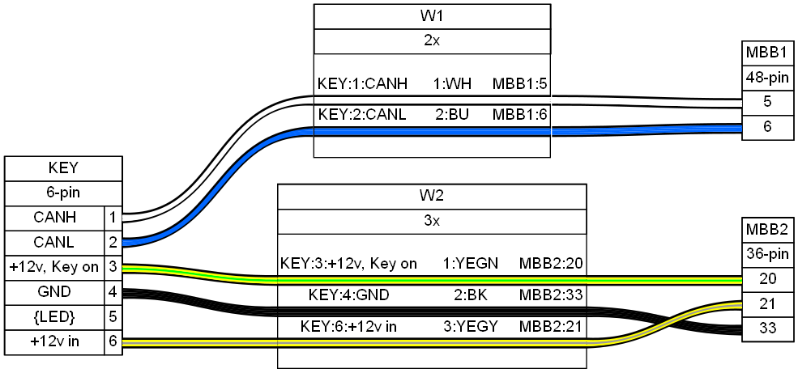

[Source](key.yml) - [Bill of Materials](key.bom.tsv)


## kickstand
```yaml

connectors:
  X1:
    pinlabels: [OUT,VCC,GND]
    notes: 'fixme: pin #?' 
  MBB2:
    pincount: 36
    hide_disconnected_pins: true

cables:
  W1:
    wirecount: 3
    colors: [YEBK, RD, BK]

connections:
  -
    - X1: [1-3]
    - W1: [1-3]
    - MBB2: [15,14,16]
```

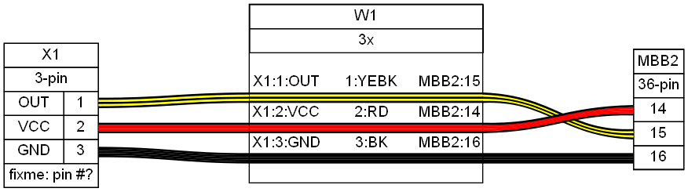

[Source](kickstand.yml) - [Bill of Materials](kickstand.bom.tsv)


## MBB
```yaml
connectors:
  MBB1:
#    pincount: 48
    pinlabels: [CANH-c,CANL-c,CANc_4pin_BK,'n.c',CANH-a,CANL-a,'GND, Dash','n.c',CANH-b,CANL-b,'GND, CCM','12v, OBDII','GND, OBDII','RX, OBDII','TX, OBDII','n.c',
      ' ',' ',' ',' ',' ',' ',' ','n.c',Fnt8pin_BNBU,Fnt8pin_BUGY,Fnt8pin_BN,Fnt8pin_BK,Fnt8pin_BURD,Fnt8pin_RDBK,Fnt8pin_BK,2pin_WHBK,
      4pin_BUBK,'Thermistor 1','Thermistor 2',3P_BK,3P_WH,3P_RD,'Unknown, OBDII',Fnt2pinA_BNGY,Fnt2pinB_WH,'BMS 1','BMS 2','BMS 3','BMS 4',5V,'Front brake SW','REARLIGHT_WHBK']

  MBB2:
#    pincount: 36
    pinlabels: ['GND, Dash',36WHOR_4pCAN_WHGN,HEADLIGHT_RDBK,BK1GRIP_HEAT,YE1GRIP_HEAT,'+12V, ACC',7lights_BN,CANc_REAR4P_OR,REARLIGHT_RDWH,'Front Turn Sig, RDGU','Front Turn Sig, WHGU','Heater, 12V battery',
      'BMS p7-YEGY','+5v, BMS_kick-RD','Sig, Kickstand','GND, Kickstand',YE2GRIP_HEAT,'+12V, ACC',19lights_BN,'+12v, Key on','+12v, Key power','Rear Turn, Left','Rear Turn, Right','n.c',
      'PWR 1','PWR 2','PWR 3','PWR 4','PWR 5','12V #3','12V #4','12V #5','Chassis ground','GND, KEY',35_4pin_RDWH,36_4pin_RDBK]    

  Thermistor:
    type: NTC
    pincount: 2 
  Licence plate:
    pinlabels: [+12v,GND]
    notes: Light
  DIAG:
    type: OBDII
    pinlabels: [' ',' ',' ',CHASSIS,GND,'CAN H',' ',RX,TX,' ','CCM GND',' ',' ','CAN L',' ',+12v]
    hide_disconnected_pins: true
    notes: fixme
  DIAG2:
    style: simple
    pincount: 1
  X1grip:
    pincount: 2
  X2grip:
    pincount: 2
  KICK:
    pinlabels: [OUT,VCC,GND]
    notes: 'fixme: pin #?'
  Rear Lights:
    type: MX150
    pinlabels: [RIGHT,GND,LEFT,GND,'5','6','7','8']
    manufacturer: Molex
    mpn: '<a href=https://www.molex.com/content/dam/molex/molex-dot-com/products/automated/en-us/salesdrawingpdf/334/33482/334824801_sd.pdf>33482-4801</a>'


cables:
  W1:
    wirecount: 48
    colors: [WHGY, BUGY, BK,' ', WH, BU, BK,' ', WH, BU, BK, BU, BK, BKRD, BKGY,' ',
      ' ',' ',' ',' ',' ',' ',' ',' ', BNBU, BUGY, BN, BK, BURD, RDBK, BK, WHBK, 
      BUBK, BK, BK, BK, WH, RD, GY, BNGY, WH, RD, RD, BNWH, BKWH, RD, WHBK, WHBK]

  W2:
    wirecount: 36
    colors: [BNBU, WHOG, RDBK, BK, YE, BU, BN, OG, RDWH, RDGY, WHGY, CUBK,
      YEGY, RD, YEBK, BK, YE, BU, BN, YEGN, YEGY, RDGY, WHGN,' ',
      BU, BU, BU, BU, BU, BU, BU, BU, BK, BK, RDWH, RDBK]


connections:
  -
    - MBB1: [1-3,5-7,9-15,25-48]
    - W1: [1-3,5-7,9-15,25-48]
#~~~
  -
    - W1: [34,35]  
    - Thermistor: [1-2]
  -
    - W1: [13,9,14,15,11,10,12]
    - DIAG: [GND,'CAN H',RX,TX,'CCM GND','CAN L',+12v]


  -
    - W1: [39]
    - DIAG2: [1]

  -
    - MBB2: [1-23,25-36]
    - W2: [1-23,25-36]
#~~~
  -
    - W2: [19,33]
    - Licence plate: [+12v,GND]
  -
    - W2: [5,4]
    - X1grip: [1-2]

  -
    - W2: [17,33]  
    - X2grip: [1-2]

  -
    - W2: [15,14,16]
    - KICK: [OUT,VCC,GND]

  -
    - W2: [23,33,22,33,9,33,7]
    - Rear Lights: [1-7]
  -
    - W1: [48]
    - Rear Lights: [8]
  ```

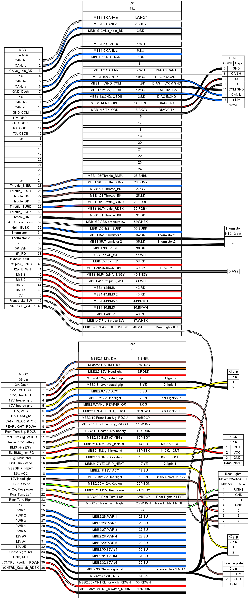

[Source](MBB.yml) - [Bill of Materials](MBB.bom.tsv)


## motor
```yaml
connectors:
  X1:
    type: MX150
    pincount: 4
    manufacturer: molex
    mpn: '<a href=https://tools.molex.com/pdm_docs/sd/334810401_sd.pdf>33481-0401</a>'
  X2:
    pincount: 35
    manufacturer: TE
    hide_disconnected_pins: true
  X3:
    pinlabels: [A,B,C,D,E,F,G,H]
    manufacturer: Delphi
    hide_disconnected_pins: true

cables:
  W1:
    wirecount: 4
    colors: [BK, BUGY, WHBG, OG]
  W2:
    wirecount: 6
    colors: [BU,WH,BK,RD,BK,WH]
  LOOP:
    wirecount: 1
    colors: [BU]

connections:
  -
    - X1: [1-4]
    - W1: [1-4]
    - X2: [1,2,13,24]
  -
    - X3: [A,B,C,E,G,H]
    - W2: [1-6]
    - X2: [21,33,9,35,12,32] 

  -
    - X2: [3]
    - LOOP: [1]
  -
    - X2: [14]
    - LOOP: [1]


additional_bom_items:
  -
    description: Label
    manufacturer: BizLink Technology(Shenzhen)
    mpn: 56-08188 rev 4
```

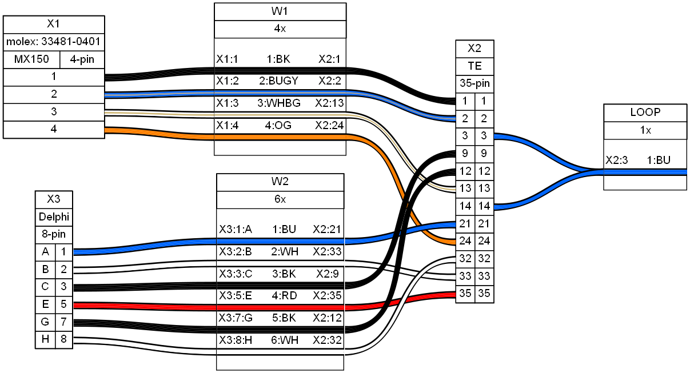

[Source](motor.yml) - [Bill of Materials](motor.bom.tsv)


## OBDII
```yaml
connectors:
  DIAG:
    type: OBDII
    pinlabels: [' ',' ',' ',CHASSIS,GND,CANH,' ',RX,TX,' ','CCM GND',' ',' ',CANL,' ',+12v]
    hide_disconnected_pins: true
  MBB:
    pincount: 48
    hide_disconnected_pins: true
  MBB2:
    pincount: 36
    hide_disconnected_pins: true
  DIAG1:
    style: simple
    pincount: 1

cables:
  W1:
    wirecount: 7
    length: 3
    colors: [BK, WH, BKRD, BKSL, BK, BU, BU]
  W2:
    wirecount: 1
    colors: [BKBU]
  W3:
    wirecount: 1
    color: GY

connections:
  -
    - DIAG: [GND,CANH,RX,TX,'CCM GND',CANL,+12v]
    - W1: [1-7]
    - MBB: [13,9,14,15,11,10,12]
  -
    - W3: [1]
    - DIAG1: [1]
  -
    - W3: [1]
    - MBB: [39]
  -
    - DIAG: [CHASSIS]
    - W2: [1]
    - MBB2: [33]
```

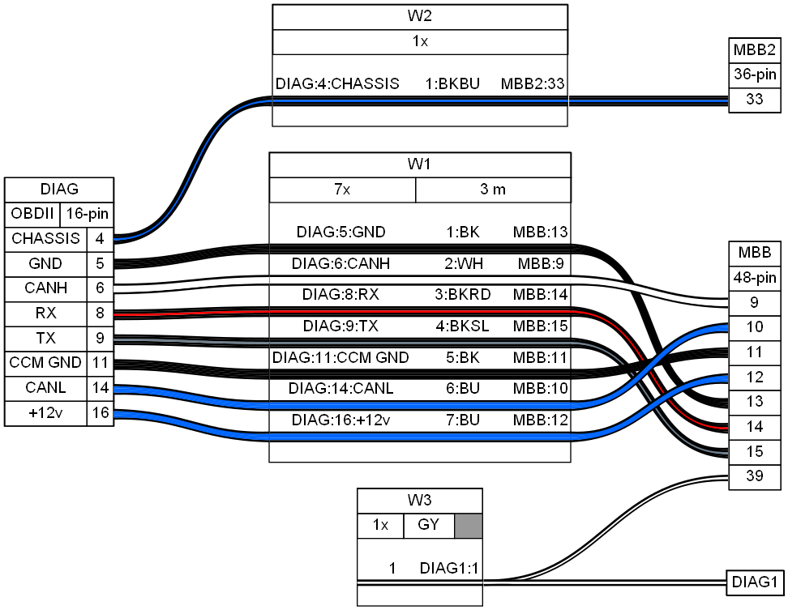

[Source](OBDII.yml) - [Bill of Materials](OBDII.bom.tsv)


## rear_lights
```yaml
connectors:
  X1:
    type: MX150
#    pincount: 8
    pinlabels: [RIGHT,'R GND',LEFT,'L GND','5','6','7','8']
    manufacturer: Molex
    mpn: '<a href=https://www.molex.com/content/dam/molex/molex-dot-com/products/automated/en-us/salesdrawingpdf/334/33482/334824801_sd.pdf>33482-4801 </a>'
  X2:
    pincount: 4
  X3:
    style: simple
    pincount: 1
  X4:
    style: simple
    pincount: 1
  X5:
    style: simple
    pincount: 1
  X6:
    style: simple
    pincount: 1


cables:
  TurnSignal:
    wirecount: 4
    length: 14 in
    colors: [WHGN, BK, RDGY, BK]
    notes: Harn S MBB ctrl CHS
  BrakeLight:
    wirecount: 4
    length: 14 in
    colors: [WHRD, WHBK, BK, BN] 
    notes: Harn S MBB ctrl CHS
connections:
  -
    - X1: [RIGHT,'R GND',LEFT,'L GND']
    - TurnSignal: [1-4]
  -
    - TurnSignal: [1]
    - X3: [1]
  -
    - TurnSignal: [2]
    - X4: [1]
  -
    - TurnSignal: [3]
    - X5: [1]
  -
    - TurnSignal: [4]
    - X6: [1]
  -
    - X1: [5-8]
    - BrakeLight: [1-4]
    - X2: [4-1]

additional_bom_items:
  - # define an additional item to add to the bill of materials (does not appear in graph)
    description: Label
    manufacturer: BizLink Technology(Shenzhen)
    mpn: 56-08201 rev 2
```

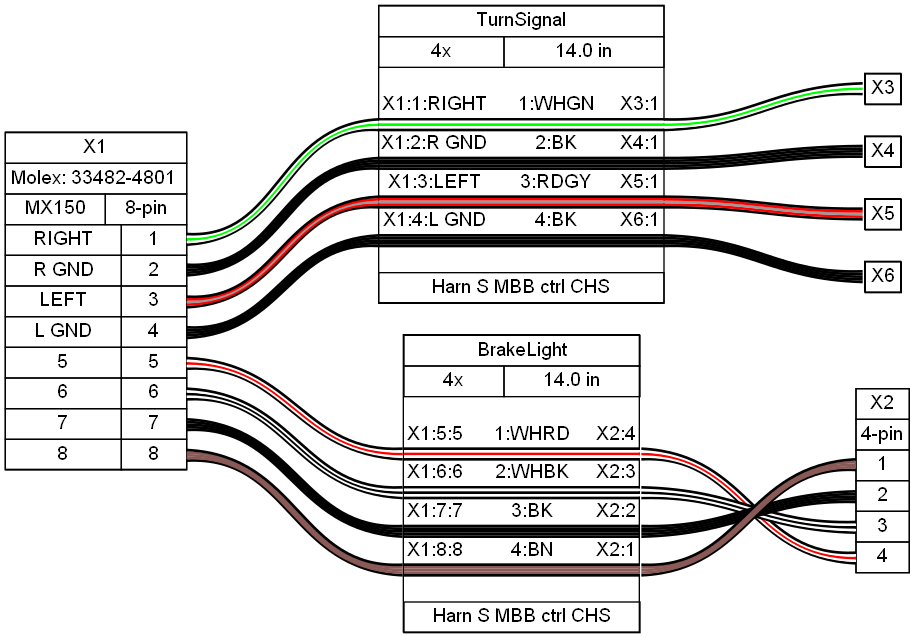

[Source](rear_lights.yml) - [Bill of Materials](rear_lights.bom.tsv)


## thermistor
```yaml
# NTC thermistor, near 12V Aux and Zadi Key wires break away
connectors:
  Thermistor:
    type: NTC
    pincount: 2 
    notes: '~12Kohm @ room temperature'
  MBB1:
    pincount: 48
    hide_disconnected_pins: true
cables:
  W1:
    wirecount: 2
    colors: [BK, BK]
    notes: Sensor in harness 
connections:
  -
    - Thermistor: [1-2]
    - W1: [1-2]
    - MBB1: [34,35]
```

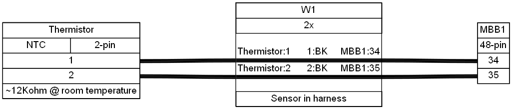

[Source](thermistor.yml) - [Bill of Materials](thermistor.bom.tsv)


